# Figma를 활용해 디자인 시스템 제작

[Figma](http://figma.com/)는 웹의 강력한 기능과 접근성을 활용한 최초의 디자인 도구로 세상에 등장했고, 뛰어난 협업 시스템을 보여주며 사람들을 놀라게 만들었습니다. Figma는 기획자, 디자이너, 개발자 그리고 클라이언트까지 모두 공유할 수 있고 동시에 여러 개의 마우스 포인터가 한 문서에서 그려지는 마법을 보여주었습니다.

오늘 날, 즉각적인 협업 방식은 안정적인 디자인 시스템을 만드는데 중요한 역할을 하는 것으로 입증되었습니다. 기획자, 디자이너, 개발자는 Figma 세계를 통해 모든 것을 하나로 모아 활용할 수 있게 되었습니다.

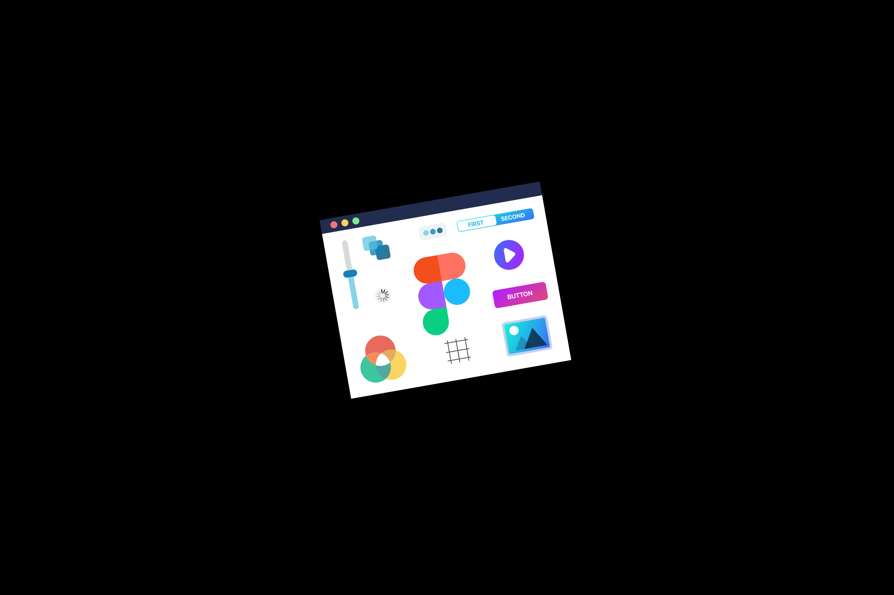

## 디자인 시스템이란?

디자인 시스템은 디자인에서 개발(코드) 협업이 아우러지는 스타일 가이드(Style Guide)를 말합니다. 디자이너만 공유한느 스타일 가이드가 아닙니다. 기획자, 디자이너, 개발자, 관리자를 포함한 모든 팀원이 공유하는 가이드를 말합니다. 결과적으로 디자인 시스템은 디자인과 코드를 제공하는 문서로, 역동적이고 재사용 가능하며 실시간으로 유지보수 할 수 있어야 합니다.

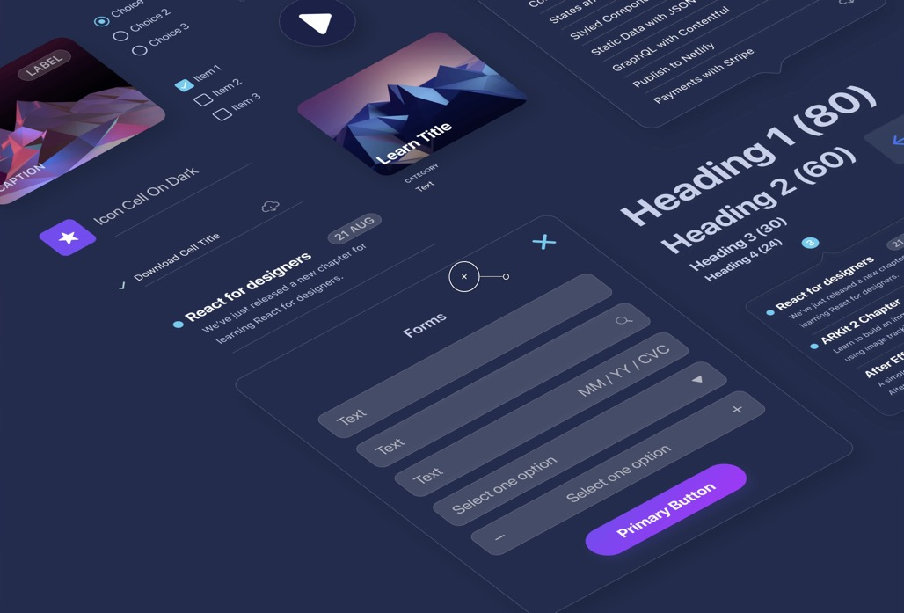

## 디자인 시스템 학습 목표

Figma를 사용하여 팀 전체가 공유할 수 있는 재사용 가능한 스타일, 텍스트, 컬러, 아이콘과 같은 컴포넌트를 사용하여 디자인 시스템을 구축해봅니다. 디자인 기본부터 고급 워크플로우(Workflow), 팁/노하우를 학습해봅니다.
Vector 네트워크를 활용하여 아이콘을 디자인 하고, 반응형 웹을 적용해보고, 신속하게 프로토타입을 만들어 볼 것입니다. 그리고 모든 사용자와 동기화된 디자인 시스템을 공유하는 방법을 다뤄봅니다.

## 디자인 시스템 분석

디자인 시스템은 애플리케이션 최종 결과물에 사용된 컴포넌트로 구성됩니다. 컴포넌트는 별도로 관리되는 문서에서 스타일로 깔끔하게 구성되어야 합니다. 이 문서는 팀원 누구나 손쉽게 관리할 수 있어야 합니다.

개발자가 Figma 디자인 시스템 문서를 공유할 수 있도록 웹 URL을 생성할 수 있습니다. [Live Embed](https://www.figma.com/developers/embed)를 사용하여 모든 변경 사항을 사이트에서 완벽하게 반영할 수 있습니다. 

마지막으로 디자이너가 코드를 제공할 수 있도록 컴포넌트 코드를 샘플로 표시하도록 제공하는 것이 좋습니다. [Zendesk Garden](https://garden.zendesk.com/) 디자인 시스템이 좋은 예시입니다.

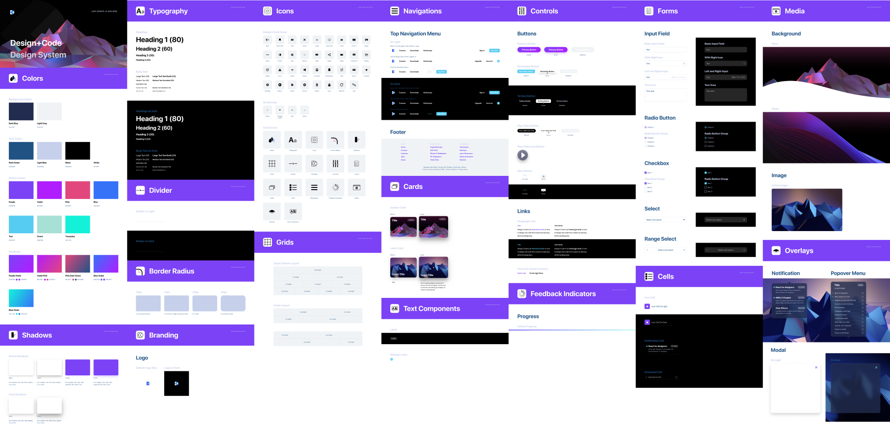

## 디자인 시스템 시작하기

디자인 시스템의 시작은 디자인 언어의 톤(Tone)을 설정하는 것입니다. 브랜딩 컨텍스트를 구성하고 로고를 적절하게 사용하는 방법을 명확하게 나타내는 것이 중요한 과정입니다. 또한 기본 컬러, 타이포그래피 및 그리드를 설정해야 합니다.

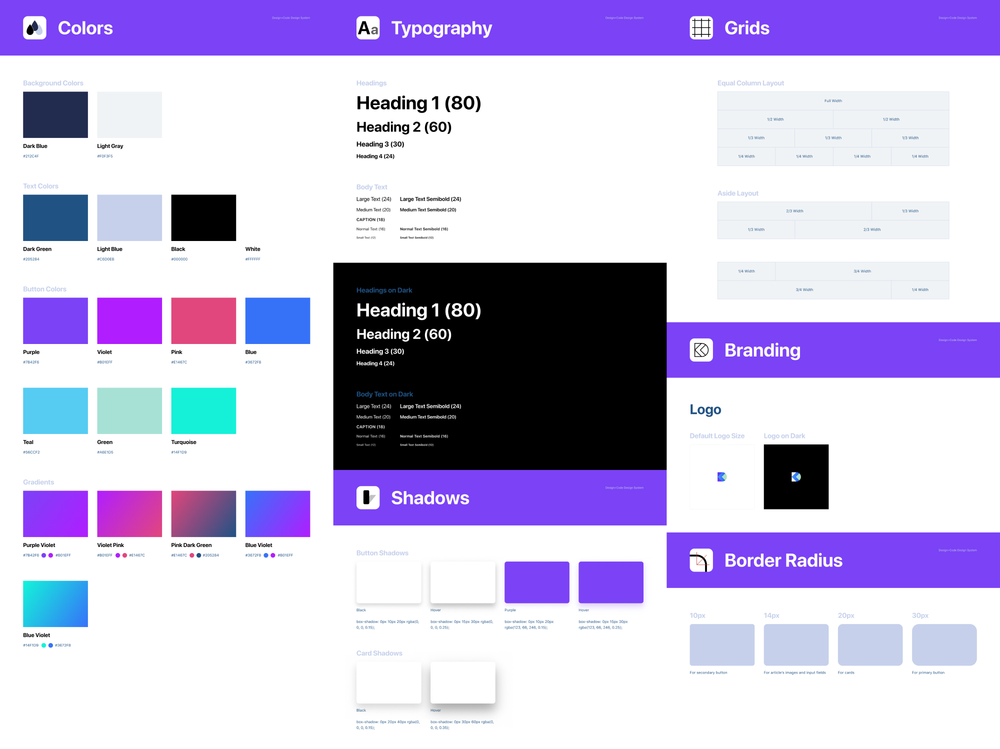

## Figma 스타일(Styles)

Figma에서 대부분의 기본 요소는 컬러, 스타일(이미지, 그레디언트 포함), 텍스트, 이펙트로 구성합니다. 이러한 요소를 팀이 공유해 사용할 수 있도록 라이브러리로 만들 수 있습니다. 디자인 과정에서 Inspector의 Text, Fill, Stroke, Effects 등을 사용해 각 스타일을 설정 할 수 있습니다.

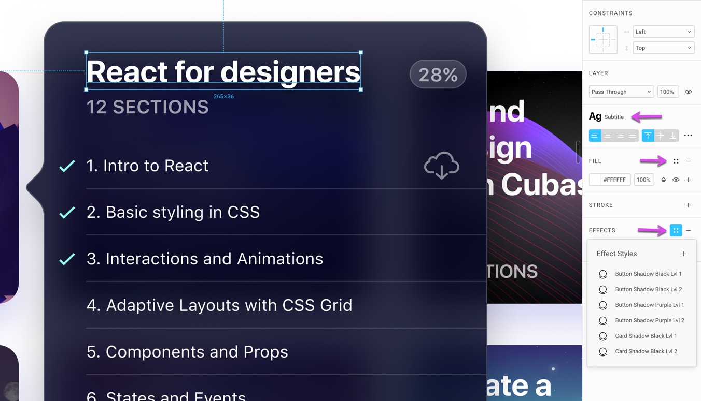

## Figma 룰(Rules)

디자인 시스템 시작 과정에서 또 다른 중요 부분은 그리드(Grid)를 사용하여 각 요소를 배치할 수 있는 레이아웃 규칙(페이지 나누기, 간격 설정)을 설정하는 것입니다.

### 컴포넌트(Components)

컴포넌트는 디자인 시스템 빌딩 블록(Building Block) 입니다. 일반적으로 버튼, 폼, 내비게이션, 카드, 셀, 오버레이와 같이 재사용 가능한 방식으로 구성된 요소 모음을 말합니다. 텍스트, 컬러, 이미지와 같은 컴포넌트는 Inspector에서 개별 정의할 수 있습니다. 콘텐츠와 스타일이 각기 다른 버튼 컴포넌트를 여러 개 만들어 사용할 수 있습니다.

또한 컴포넌트 안에 중첩된 또 다른 컴포넌트를 만들 수 있어 아이콘, 상태(states), 복잡한 테마(themes)와 같은 복잡한 컴포넌트도 만들어 활용할 수 있습니다.

예를 들어 테이블 셀은 토글(Toggle)을 포함한 컴포넌트일 수 있으며, 포함된 컴포넌트는 다른 컴포넌트에서도 활용될 수 있습니다. 토글은 On, Off 사이 전환되는 컴포넌트를 말합니다.

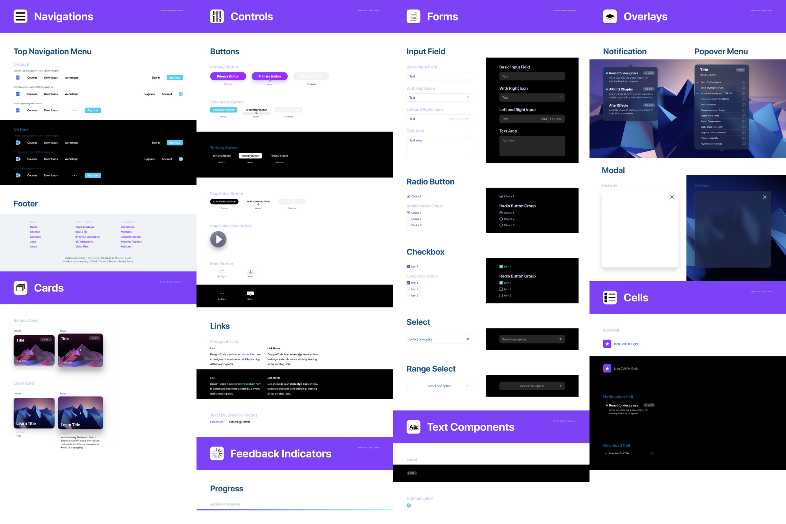

### 에셋(Assets)

에셋(자산)은 아이콘, 백그라운드, 아바타 및 앱 콘텐츠를 채우는데 사용되는 이미지를 말합니다. 일반적으로 [Unsplash](https://unsplash.com/), [UI Names](https://uinames.com/), [UI Faces](http://uifaces.co/)의 무료 에셋을 활용하거나, 직접 이미지를 제작해 UI를 제작할 수 있습니다. 이러한 이미지를 스타일로 설정할 수 있으므로 디자인 시스템에서 빠르게 활용 할 수 있도록 이미지 리스트를 만들 수 있습니다.

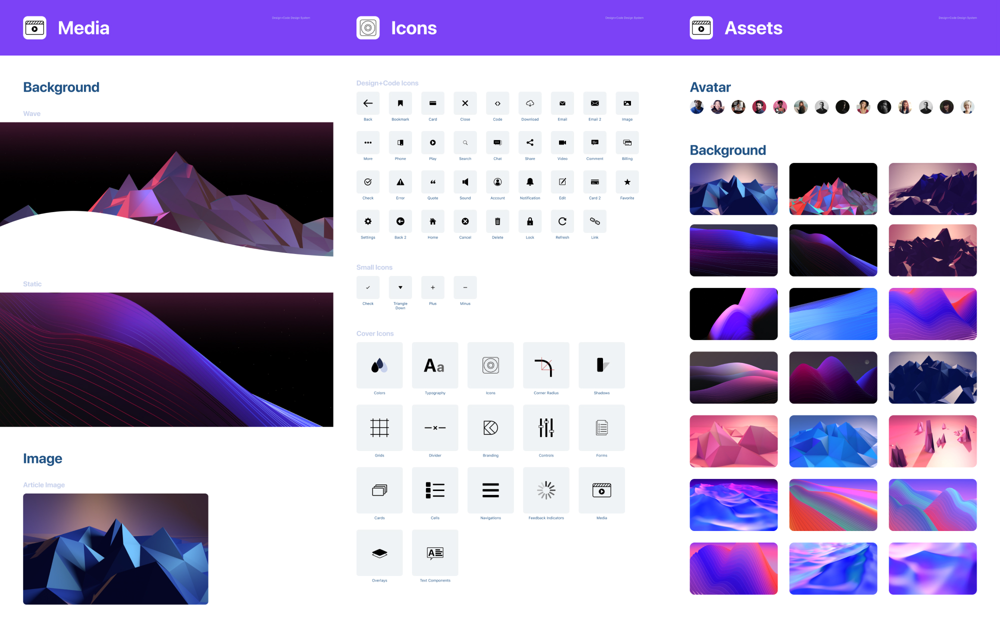

## Figma vs Sketch

오늘 날 디자인 도구는 매우 유사합니다. Figma와 Sketch 모두 레이아웃 기능, 컴포넌트, 라이브러리, 개발자(코드) 핸드 오프(Hand-Off)와 같은 기능을 동일하게 제공합니다.

Sketch는 [Craft](https://www.invisionapp.com/craft), [Abstract](http://goabstract.com/), [Zeplin](https://zeplin.io/)과 같은 유용한 플러그인을 제공하지만, Figma는 그 자체에 모든 도구가 포함되어 있습니다. 또한 Figma는 실시간 협업 기능을 갖추고 있고 모든 콘텐츠가 웹에 존재하며, Sketch와 달리 Windows 운영체제에서도 작동 가능합니다. ([Sketch는 Mac 운영체제만 제공](https://www.sketch.com/support/requirements/other-platforms/))
이것이 Figma 사용을 추천하는 이유입니다. 

> **␥ Tip** [Lunacy](https://icons8.com/lunacy)를 사용하면 Sketch 파일을 Windows 운영체제에서도 열어 편집 가능합니다.

### Sketch 가져오기(Import)

Figma는 Sketch로 제작된 파일을 가져와 사용할 수 있고, 복잡하고 방대한 파일 또한 호환 가능합니다. Sketch에서 제작한 모든 레이어, 심볼(Symbols)을 Figma에서 그대로 사용할 수 있습니다.

## 크로스 플랫폼

Figma는 Mac, Windows, Linux 특정 플랫폼을 가리지 않으며 심지어 애플리케이션 설치 과정 없이 웹 브라우저에서 바로 사용 가능한 막강한 도구입니다. 덕분에 디자인 하는 동안 누구나 디자인 과정에 참여할 수 있습니다. Windows를 사용하는 기획자와 클라이언트, Mac을 사용하는 개발자 할 것 없이 디자인 시스템에 접근하는데 제약이 없으며 동기화 된 변경사항을 실시간으로 확인 할 수 있습니다.

## 실시간 협업

Figma는 디자인 세상의 Google Docs 입니다. 디자인 프로젝트에서 팀원(기획자, 개발자), 클라이언트와 공동 작업을 시작하면 기존의 워크플로우로 돌아가고 싶지 않을 것입니다. 디자인을 다른 사람과 공유할 수 있으며 진행 상황을 확인하고 의견을 댓글로 달아 전달할 수 있습니다.

## 버전 관리

Figma는 별도로 저장(Ctrl+S)하지 않아도 됩니다. 실시간 저장되기 때문입니다. 필요한 경우 직접 작업 내용을 버전 관리 타임라인에 커밋(Commit)할 수도 있습니다. 개발자와 달리 디자이너는 Git을 사용하는 것을 어려워 하기 때문에 Figma의 버전 관리 기능을은 디자이너에게 축복과 같습니다.

## 벡터 네트워크

Figma는 벡터(Vector)를 디자인 하는 강력하고 새로운 방법을 도입했습니다. 패스(Path)를 1:1로 연결하는 대신 웹과 같은 연결을 만들어 아이콘을 만드는 과정을 유연하게 만들 수 있습니다.

## 성능

오늘 날 대부분 도구는 새로운 기능에 대해 과대한 광고를 하지만, Figma는 비교 불가능한 성능을 갖춘 견고한 워크 플로우에 중점을 둡니다. UI 디자인에 최적화 된 도구로 요소를 드래그 하고 텍스트를 편집하거나, 확대/축소 시 전혀 속도의 느려지는 현상을 경험할 수 없습니다.

## 팀 라이브러리

팀 라이브러리를 사용하면 팀 전체에서 컴포넌트, 스타일 및 에셋을 공유 할 수 있습니다. 오른쪽 상단 팀 라이브러리 아이콘을 활성화 및 비활성화 할 수 있습니다. 이것은 디자인 시스템에 절대적으로 필요합니다.

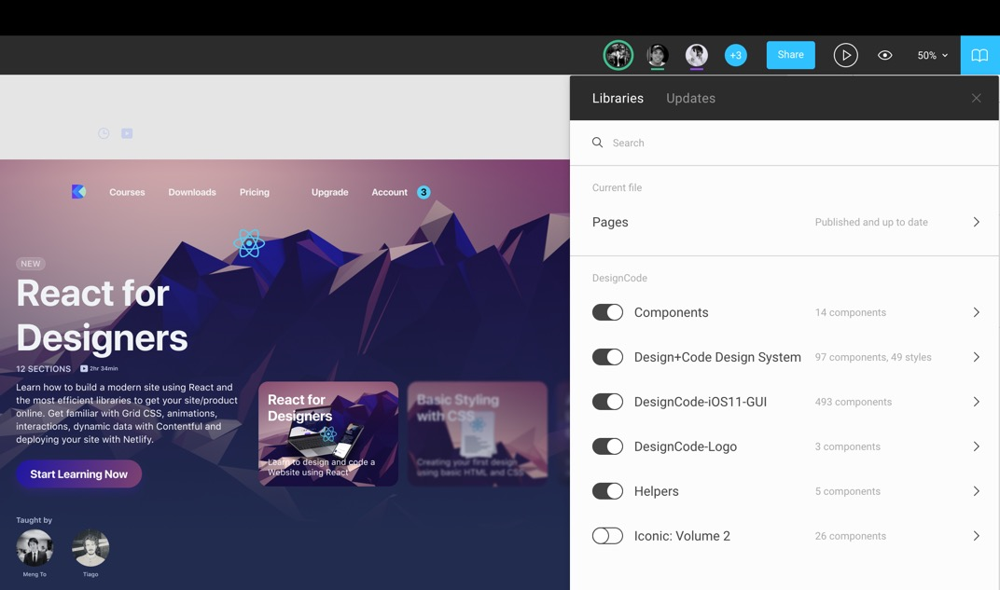

## 라이브 임베드

`<iframe>`을 사용해 웹 사이트에 Figma 프레임을 내장 할 수 있습니다. 이를 통해 디자인 시스템에 실시간으로 접근 할 수 있습니다.

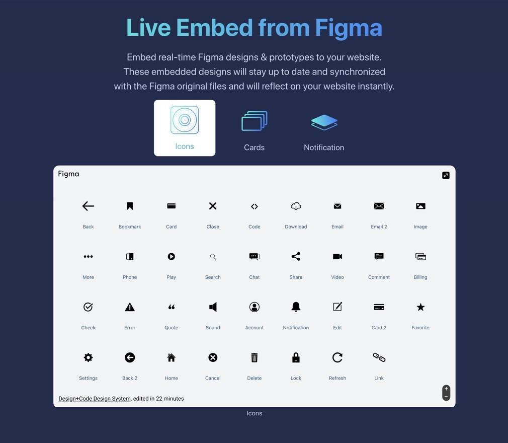

## 텍스트 / 컬러 스타일

Figma는 스타일을 다르게 설정합니다. 텍스트 뿐만 아니라 컬러과 그레디언트, 블러 및 쉐도우와 같은 효과에도 사용할 수 있습니다.

## 키보드 단축키

[Figma의 단축키](https://shortcuts.design/toolspage-figma.html)는 [Sketch](https://shortcuts.design/toolspage-sketch.html)와 매우 유사합니다. 알아야 할 몇 가지 주요 차이점은 다음과 같습니다.

- `Command + Option + G`는 선택한 요소에 대한 프레임(Frame)을 만듭니다. 프레임은 아트보드(Artboard)와 같습니다.
- `Control + G`는 그리드(Grid)를 토글 합니다.
- 요소의 속성을 보존하고 스케일을 변경하려면 `K`를 누른 후 사용합니다.
- `C` 키는 Figma 파일에 직접 의견을 달 수 있습니다.

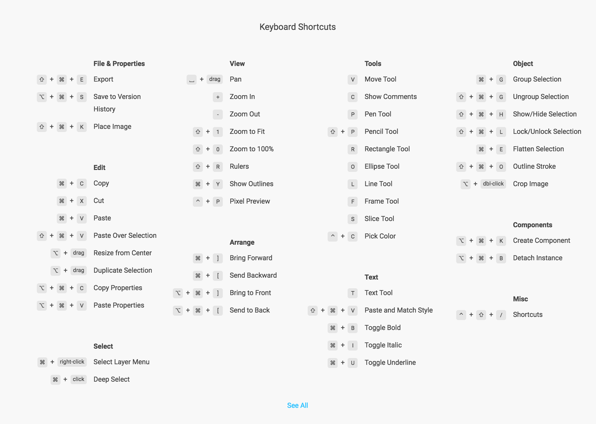

## 컨스트레인트(Constraints)

Figma의 컨스트레인트 조건은 Sketch와 동일합니다. 
부모 컨테이너에서 거리를 설정하거나, 크기를 조정하거나 정렬 할 수 있습니다.

## 프로토타이핑(Prototyping)

Figma는 자체적으로 프로토타입을 만들 수 있는 기능을 제공합니다. 프로토 타입 도구는 Inspector의 자체 탭에  포함되어 있습니다. 제공되는 트랜지션 애니메이션은 인스턴트, 디졸브, 이동, 슬라이드 및 푸시 등이니다.

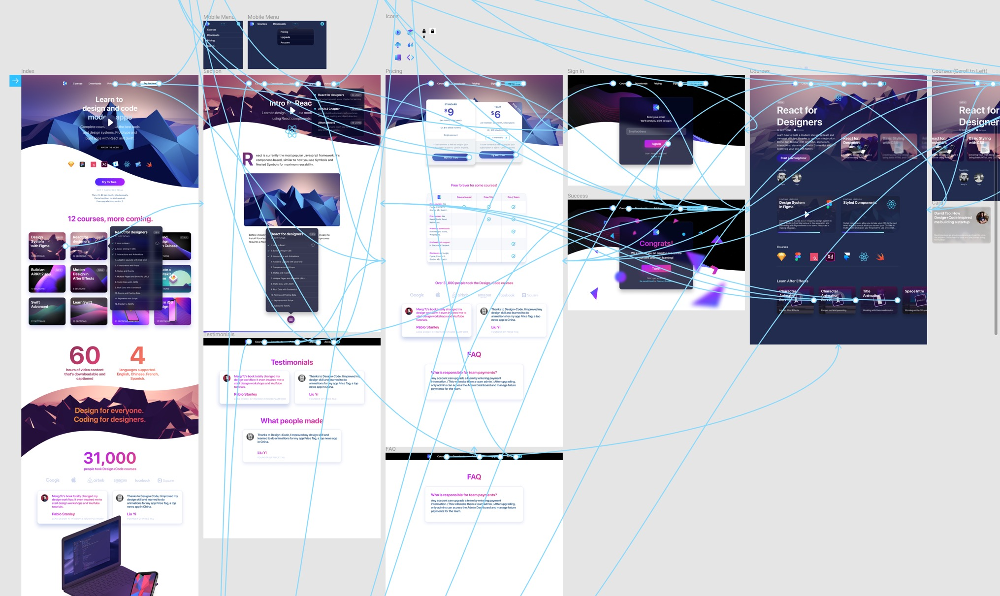

## 인스펙트(Inspect)

Figma로 제작된 디자인 파일을 열어 개발자가 컬러, 크기 및 거리 정보를 업을 수 있습니다. 에셋을 선택 내보내거나, 개발에 필요한 코드를 핸드 오프(Hand-Off) 할 수 있습니다.

## 코멘팅(Commenting)

팀 프로젝트 환경에서 피드백(Feedback) 루프는 매우 중요합니다. Figma 문서에서 `C` 키를 코멘트 입력 창을 화면에 띄운 후, 의견을 남기면 팀원에게 @멘션하여 알림 처리됩니다.

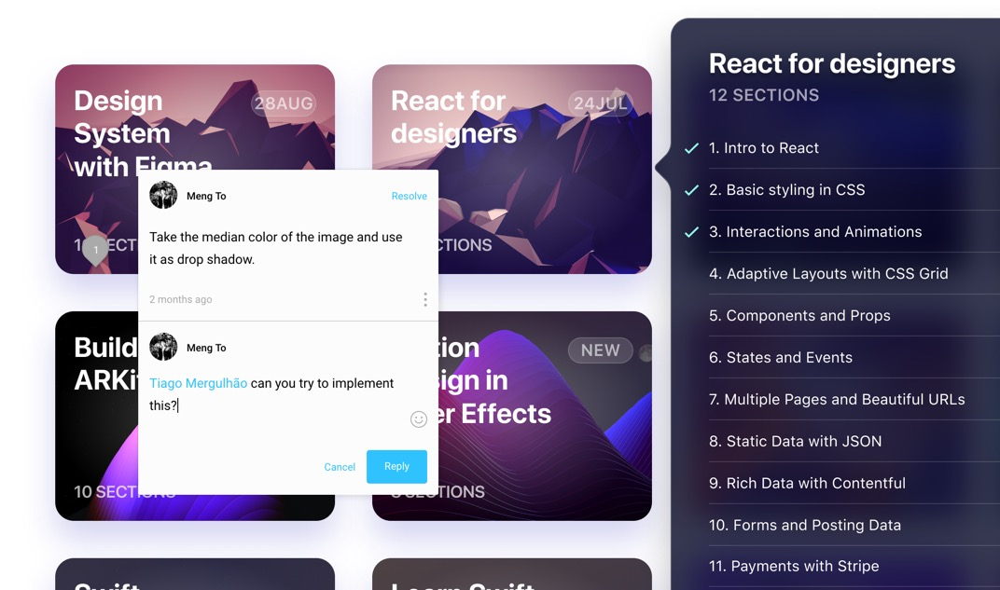

## Figma 다운로드

Figma는 웹 브라우저에서 바로 가동하지만, 보다 뛰어난 제작 경험을 요한다면 Windows 또는 Mac용 설치 프로그램을 [다운로드](https://www.figma.com/downloads/) 할 수 있습니다. 사용자의 운영체제에 Figma를 설치하면 로컬 폰트를 사용하여 디자인 할 수 있습니다.

## 로컬 폰트

로컬 컴퓨터의 폰트에 접근하려면 [Account settings](https://www.figma.com/settings)(웹 브라우저에서 디자인 할 경우)에 헬퍼(Helper)를 설치하거나, 데스크탑 설치 앱을 사용합니다.

## 팀 생성

혼자 또는 다수의 사람들과 팀을 생성할 수 있습니다. 무료 사용일 경우 스타터 팀은 3개, 팀원은 2명까지 입니다. 대규모 기업이 아닐 경우 무료 사용만으로도 충분히 효과적으로 프로젝트를 수행할 수 있습니다.

## Figma 파일 / 프로젝트

새로운 Figma 파일을 생성하면 Recent 또는 Drafts에서 확인할 수 있습니다. 팀이 설정되어 있으면 파일을 프로젝트 안으로 이동시켜 팀 전체에서 프로젝트를 공유 할 수 있습니다. Figma 파일은 페이지, 프레임을 포함합니다.

## 템플릿

[Figma Resources](https://www.figma.com/resources/)를 방문 하면 Material, iOS UI Kits과 같은 템플릿을 얻을 수 있습니다. 상태 표시 줄, 탭 표시 줄, 버튼과 같은 요소를 재사용 할 수 있어 모든 것을 처음부터 만들지 않아도 되어 유용합니다. 또한 무료로 제공되는 아이콘 세트를 찾아 활용할 수도 있습니다. 

- Iconic [Volume 1](https://www.figma.com/file/4UApXbATsMrvF48asT2qiU/Iconic:-Volume-1/duplicate)
- Iconic [Volume 2](https://www.figma.com/file/bsKj2c8e8YSyTu1e1oIe4l/Iconic:-Volume-2/duplicate)

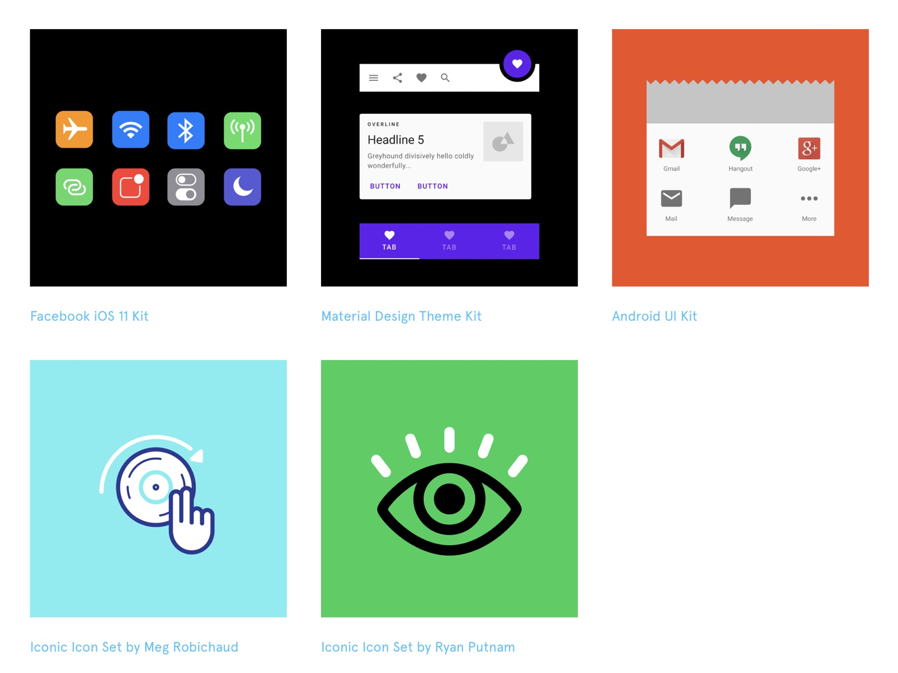