# 디자인 시스템에 대해 알아야 할 모든 것

> 프로덕트 디자이너 Audrey Hacq의 [Everything you need to know about Design Systems](https://uxdesign.cc/everything-you-need-to-know-about-design-systems-54b109851969) 글을 번역 하였습니다. — 야무(yamoo9)

<figure style="margin: 30px auto; max-width: 650px; text-align: center;">
  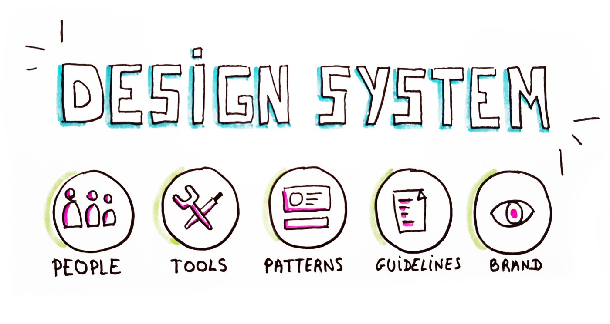
</figure>

디자인 시스템은 제 일상 업무의 핵심 부분이 되었습니다. 그리고 제 주변의 토론을 통해 지금은 많은 사람들에게 해당되는 것 같습니다. 

작년에 [Alla Kholmatova](https://medium.com/@craftui)의 [Design Systems](https://vk.com/wall-80984752_12776)을 읽은 후, 지난 3월 이 주제에 관한 첫 번째 유럽 컨퍼런스에 참석하게 되어 운이 좋았습니다. 이 모든 것이 미래의 모든 브랜드와 모든 제품이 단순하거나 포괄적 또는 엄격하거나 느슨한, 모노 또는 크로스 플랫폼 디자인 시스템을 사용할 것이라는 확신이 들었습니다.

 

## 디자인 시스템이란?

디자인 시스템은 팀이 제품을 설계, 실현 및 개발 할 수 있도록 모든 요소를 ​​그룹화 하는 하나의 소스입니다.
일반적인 산출물(deliverable)이 아니라 산출물(a set of deliverables) 세트입니다. 
디자인 시스템은 제품, 도구 및 새로운 기술과 함께 지속적으로 발전합니다.
Jina Anne이 컨퍼런스의 [Design Systems 인류학(Anthropology)](https://vimeo.com/262958762)에서 설명 했듯이 
시스템은 유형(tangibles) 또는 무형의 요소(non-tangibles elements)로 구성됩니다.

- **[유형]** 디자이너 및 개발자를 위한 도구, 패턴, 구성 요소, 가이드라인...
- **[무형]** 브랜드 가치, 공유된 작업 방식, 사고 방식, 공유된 신념과 같은 추상적인 요소...

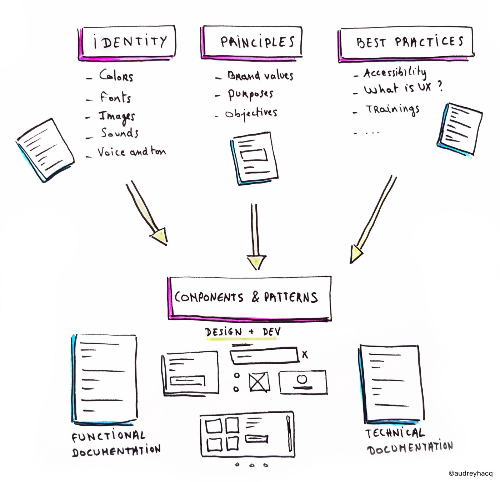

 

## 스타일 가이드, 패턴 라이브러리와 무엇이 다른가요?

스타일 가이드와 패턴 라이브러리는 디자인 시스템 결과물 중 일부에 불과합니다.
스타일 가이드는 그래픽 스타일(색상, 글꼴, 일러스트레이션 등)과 그 사용법에 초점을 맞춘 결과물입니다.
반면 패턴 라이브러리는 함수 컴포넌트와 사용법을 통합한 결과물입니다.

대부분 오늘 날의 디자인 시스템은 [Shopify 디자인 시스템](https://polaris.shopify.com/) 처럼 마찬가지로 스타일 가이드에 대한 "디자인(DESIGN)" 탭과 패턴 라이브러리에 대한 "컴포넌트(COMPONENTS)" 탭이 모두 포함되어 있습니다.

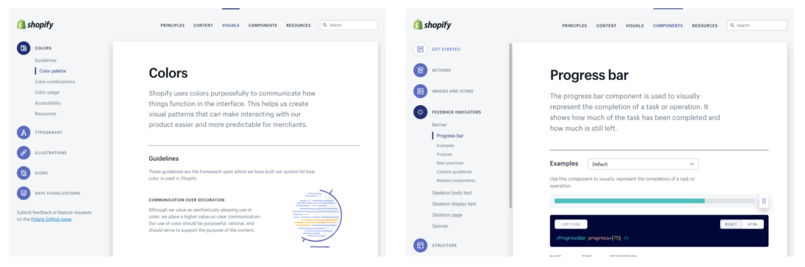

 

## 우리는 왜 그것에 대해 이야기하고 있습니까?

설계(Design)와 컴포넌트(Components)를 분해 하려는 욕구는 새로운 것이 아닙니다. 
하지만 우리는 지난 몇 년 동안 추세가 가속화 되었음을 알 수 있습니다. 
점점 더 많은 회사가 디지털 지원을 기반으로 하고 있으며 더 이상 인쇄에 대한 그래픽 가이드라인도 없습니다!

오랫동안 디지털은 "사이드 프로젝트" 처럼 취급 되었습니다. 인쇄 된 요소(printed elements)에 대한 그래픽 가이드라인을 만든 
다음 디지털에 대한 가이드라인을 추가하는 데 사용되었습니다. 300페이지에 육박한 그래픽 가이드라인에 비해 6페이지에 불과한 디지털 가이드라인?
디자이너로서 브랜드에서 기대하던 바와 달랐습니다.

<figure style="margin: 30px auto; width: 500px; text-align: center;">
  
  <figcaption style="font-size: 15px;">클라이언트의 그래픽 가이드라인을 받는 디자이너 (쓱 — 보고 휙 — 던짐)</figcaption>
</figure>

이제는 과거와 달리 공유 언어(shared language)로서 인쇄(print)와 디지털(digital) 간의 격차를 좁혀야 합니다.
디자인 시스템은 그래픽 가이드라인을 잇는 후손이지만, 보다 성숙하고 팀의 작업 흐름(Workflow)에 더욱 통합되었습니다. 
뿐만 아니라 컴포넌트 시스템을 구축하고 공유 할 수 있는 도구로서 발전 하였습니다.

 

## 디자인 시스템의 실체적 목적

디자인 시스템의 기본 목적은 팀의 작업을 용이하게 하는 것입니다. 따라서 우리가 스스로에게 물어볼 첫 번째 질문은 "디자인 시스템에 무엇을 넣어야 할까?"가 아니라,
**“누가 그것을 어떻게 사용할 것인가?”** 입니다. 목표가 정의되고 회사에 이미 있는 것이 무엇인 지에 대한 고민했을 때(관련 주제에 대한 팀의 
성숙도 수준은? 기존 도구는 무엇인가? 등등), 어디서부터 시작해야할 지 보다 쉽게 알 수 있습니다.

### #1. 목적과 가치 공유 (Purpose and Shared Values)

<figure style="margin: 30px auto; max-width: 550px; text-align: center;">
  
  <figcaption style="font-size: 15px;">우리 어디로 가는 거야? 왜? 그리고 어떻게?</figcaption>
</figure>

디자인 시스템 제작에 앞서 명확한 목표(가치 공유)를 중심으로 팀을 조정하는 것이 중요합니다.
비전을 구축하고 모든 사람이 같은 방향을 바라 보는 데 도움이 될 수 있어야 합니다.
이러한 목표는 시간이 지남에 따라 지속적으로 발전 할 것입니다.
가치는 브랜드 목표에 따라 우리의 선택을 가이드 할 멋진 아이디어와 같습니다.
우리가 디자인하는 것이 이러한 키(Key) 값과 다르지 않음을 확인해야 합니다.

이러한 브랜드 및 제품 가치 외에도, 팀원의 공유 마인드가 가져올 팀의 가치를 정의 할 수도 있습니다.

<figure style="margin: 30px auto 60px; max-width: 550px; text-align: center;">
  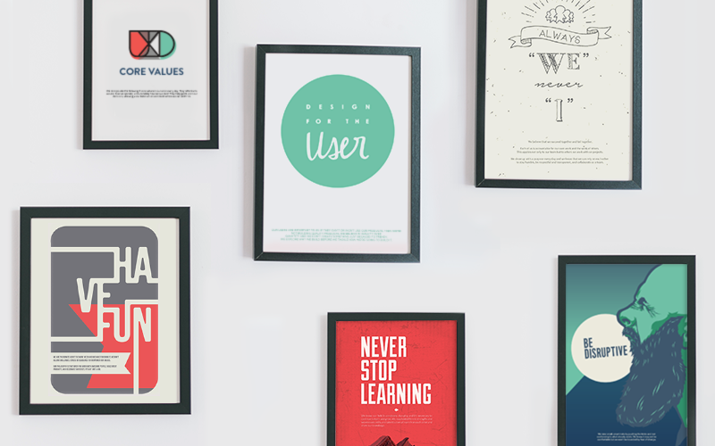
  <figcaption style="font-size: 15px;"><a href="https://www.invisionapp.com/inside-design/ux-team-core-values/">ASH 팀이 핵심 가치를 위해 만든 포스터</a></figcaption>
</figure>

### #2. 설계 원칙 (Design Principles)

가장 먼저 기억해야 할 사항은 디자인 원칙은 제품의 시각적 측면(visual aspect of a product) 그 이상이라는 것입니다.

<figure style="margin: 30px auto; width: 550px; text-align: center;">
  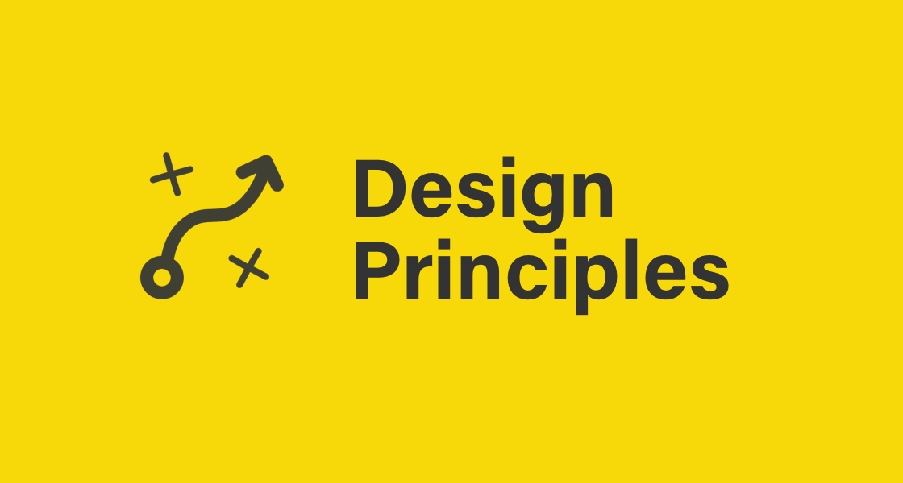
  <figcaption style="font-size: 15px;"><a href="https://principles.design/">설계(Design) 원칙</a>: 디자인 원칙 및 방법 모음</figcaption>
</figure>

  디자인 원칙은 디자인 덕분에 팀이 제품의 목적에 도달하는 데 도움이 되는 안내 문장(Guideing sentences) 입니다.

디자인 원칙은 팀이 의미있는 디자인 결정을 내리는 데 큰 도움이 됩니다. 예를 들어 [Medium](https://medium.com/)의 디자인 원칙 중 하나는 "Direction over choice" 입니다.
이 원칙 덕분에 색상과 글꼴을 무제한으로 선택할 수 있는 일반 텍스트 편집기를 디자인 하는 대신, 보다 간단한 것을 선택함으로서 작성자는 시각적인 측면(visual aspect) 보다 기사의 내용(contents)에 집중할 수 있습니다.

<figure style="margin: 10px auto 60px; width: 550px; text-align: center;">
  
  <figcaption style="font-size: 15px;">디자인 원칙은 디자인 선택을 가이드 해야 합니다.</figcaption>
</figure>

### #3. 브랜드 정체성과 언어 (Brand identity & language)

<figure style="margin: 30px auto; max-width: 550px; text-align: center;">
  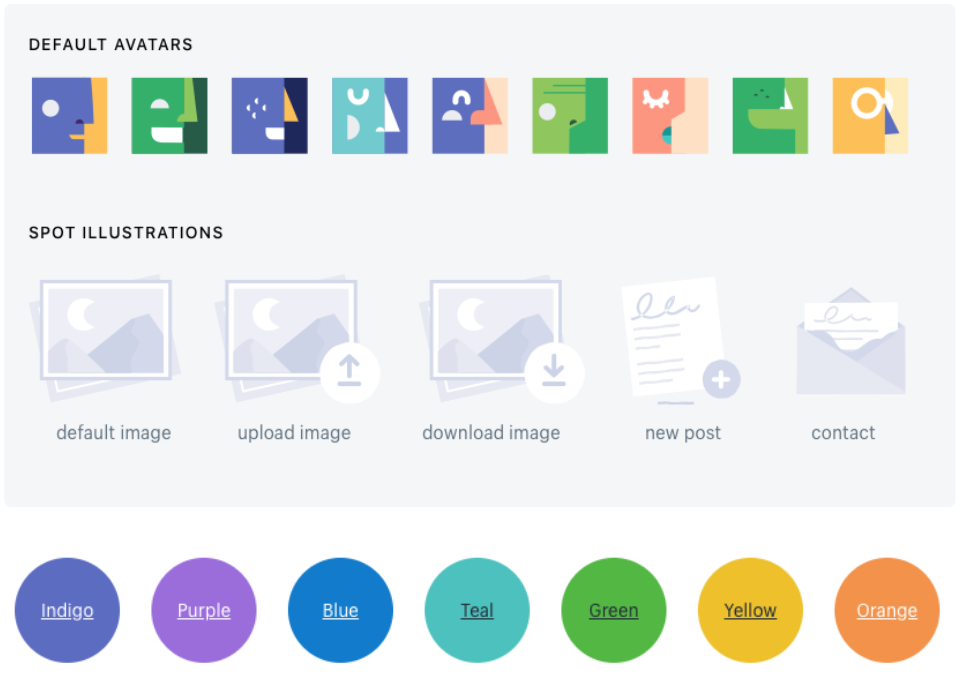
  <figcaption style="font-size: 15px;">Shopify 브랜드 아이덴티티</figcaption>
</figure>

아이덴티티는 브랜드의 전략과 목표에 따라 정의 되어야 합니다. Alla Kholmatova는 다음과 같이 나열한 "지능 패턴 (perceptual patterns)"에 대해 이야기했습니다.
이 모든 것이 브랜드의 알파벳을 형성합니다.

- 색상 (Colours)
- 글꼴 (Fonts)
- 여백 (Spaces)
- 도형 (Shapes)
- 아이콘 (Icons)
- 일러스트레이션 (Illustrations)
- 포토그래픽 (Photographies)
- 애니메이션 (Animations)
- 목소리와 어조 (Voice and tone)
- 사운드 (Sounds)

분명 좋은 출발점 이지만 언어를 말하기에는 충분하지 않습니다. 이 알파벳을 사용하여 단어를 구성한 다음 이 단어를 연결하여 의미있는 문장을 만들어야 합니다. 
이러한 브랜드 요소에는 시스템의 문법과 활용이 될 몇 가지 규칙이 필요합니다. 디자인 시스템은 가이드라인, 해야 할 일과 하지 말아야 할 일, 사용에 대한 "좋은 예"에 따라 구체화 됩니다.

<figure style="margin: 30px auto; max-width: 550px; text-align: center;">
  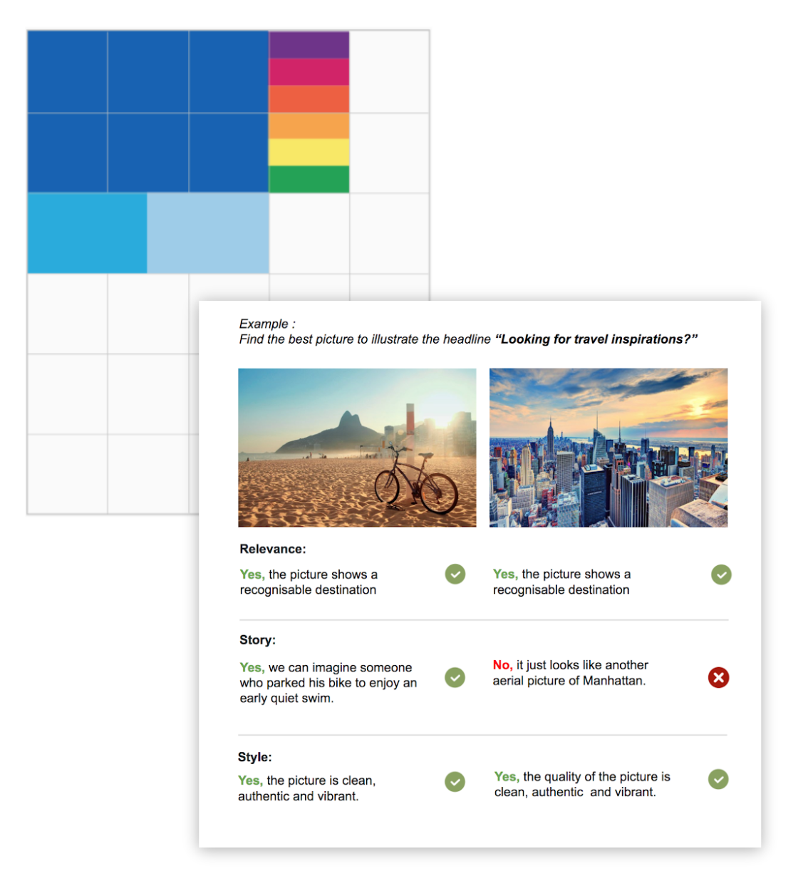
  <figcaption style="font-size: 15px;">아이덴티티 가이드라인 예시 ©<a href="https://www.backelite.com/">Backelite</a></figcaption>
</figure>

이렇게 하면 디자인 팀이 브랜드 아이덴티티 언어의 "올바른 조합(right combinations)"을 사용하여 브랜드를 돋보이게 만들 수 있습니다.

 

### #4. 컴포넌트와 패턴 (Components & patterns)

<figure style="margin: 30px auto; max-width: 400px; text-align: center;">
  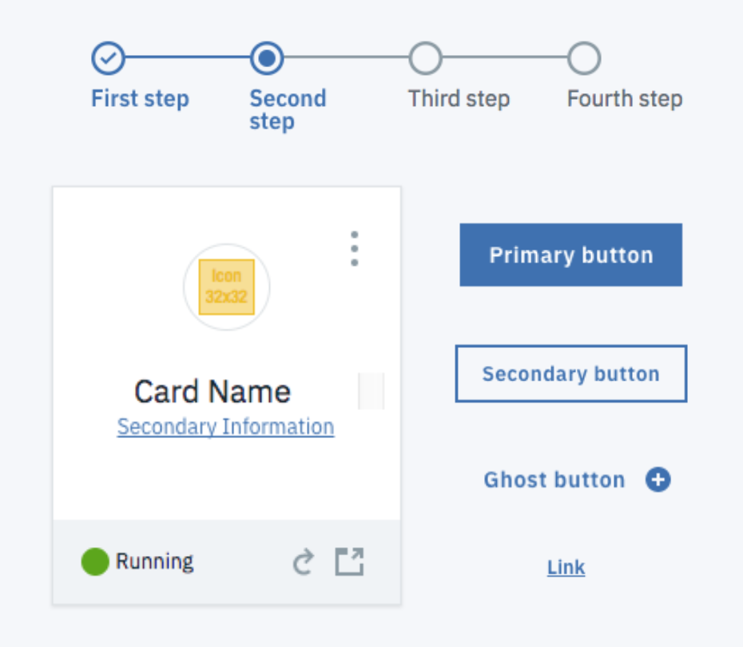
  <figcaption style="font-size: 15px;">컴포넌트(components) & 패턴(patterns)</figcaption>
</figure>

컴포넌트와 패턴은 시스템의 핵심입니다. 앞서 언급한 모든 요소는 일관 된 경험(consistent experience)을 제공하는 데 도움이 됩니다.
컴포넌트는 레고(LEGO) 블록과 같습니다. 디자이너는 Figma, Sketch에서 컴포넌트를 디자인 하고 개발자는 코드를 통해 컴포넌트를 사용합니다. 

패턴의 경우 모든 제품에서 이러한 컴포넌트를 논리적이고 일관 된 방식으로 사용할 수 있도록 하는 구축 지침(building instructions) 입니다.
아래 이미지에서 컴포넌트가 기술 및 기능 문서(specified with technical and functional documentation)로 지정되는 반면, 패턴은 사용 방법에 대한 권장 사항(recommendations)을 제공합니다.

<figure style="margin: 30px auto; max-width: 100%; text-align: center;">
  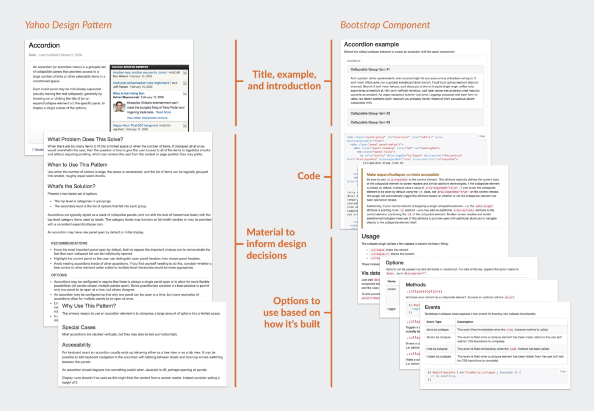
  <figcaption style="font-size: 15px;"><a href="https://medium.com/eightshapes-llc/patterns-components-2ce778cbe4e8">패턴 vs 컴포넌트</a> ©Nathan Curtis</figcaption>
</figure>

원문 | 해석
--- | ---
title, example, and introduction | 제목, 예시 및 소개
code | 코드
material to inform design decisions | 디자인 결정을 알리는 자료
options to use based on how it's built | 구축 방식에 따라 사용할 수 있는 옵션

시스템을 위해 어떤 컴포넌트를 먼저 개발해야 하는지 궁금하다면? [컴포넌트 우선 순위 지정 워크 숍](https://medium.com/@audreyhacq/workshop-how-to-prioritize-your-design-system-components-744aa99f07d7)을 실행 할 수 있습니다.

 

## 모범 사례 (Best Practices)

시스템에 연결 된 문서 외에도, 모범 사례(best practices)를 통해 보다 크고, 횡단적인(transversal) 방식으로 팀이 함께 할 수 있습니다.
모범 사례를 분석하고 통달한 이들이 팀의 제품 및 성숙도 수준을 기반으로 좋은 아이디어를 도출할 수 있습니다.
팀의 기술을 형성하고 개발하는 데 모범 사례는 많은 도움이 됩니다.

<figure style="margin: 30px auto; max-width: 550px; text-align: center;">
  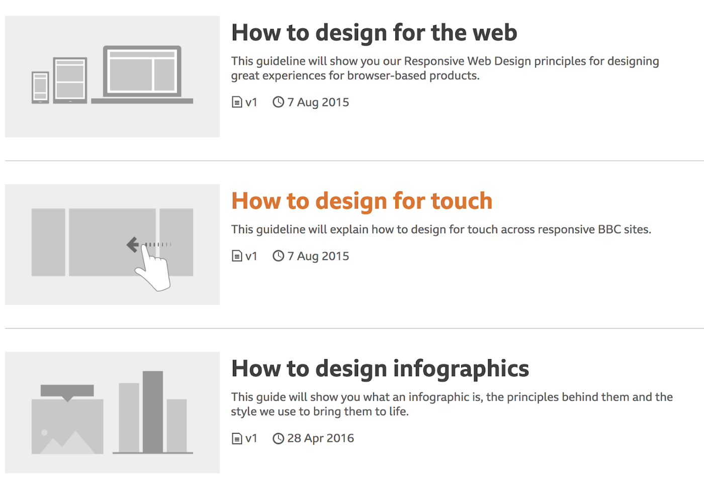
  <figcaption style="font-size: 15px;">BBC 디자인 시스템의 "HOW TO"</figcaption>
</figure>

 

## 어떤 유형의 디자인 시스템을 만들어야 할까?

디자인 시스템은 팀 또는 제품마다 한 가지 유형 이상으로 구성되므로, 디자인 시스템 정의에 앞서 다음의 질문이 필요합니다.
이 모든 답변은 가장 적절한 유형의 디자인 시스템을 정의하는 데 도움이 될 것입니다.
그녀의 책에서 [Alla Kholmatova](http://craftui.com/)는 우리에게 영감을 주었습니다.

- 얼마나 많은 사람들이 이 시스템을 사용할까요?
- 팀 또는 제품의 프로필은 무엇이며 주제에 대해 충분히 이해하고 있나요?
- 어떤 제품에? 지원 할 플랫폼의 범위는? 특정 기술(React, Vue, Angular 등)을 고려해야 할까요?
- 제품 전반에 걸쳐 어느 정도의 일관성(Consistency)을 원하나요?

 

### 엄격(Strict)한 벙법 또는 느슨(Loose)한 방법

<figure style="margin: 30px auto; max-width: 650px; text-align: center;">
  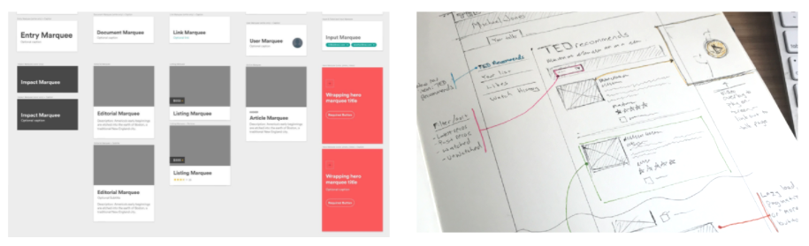
  <figcaption style="font-size: 15px;">Airbnb (왼쪽, 엄격) ⇔ TED (오른쪽, 느슨)</figcaption>
</figure>

**엄격한 시스템**은 포괄적이고 상세한 문서가 있으며 설계와 개발 간에 완벽히 동기화 됩니다. 그리고 시스템에 새로운 패턴을 도입하기 위한 엄격한 프로세스가 있을 것입니다. 
엄격한 시스템은 팀이 직면 할 수 있는 대부분의 경우를 다루기 위해 매우 광범위 해야 합니다.

**느슨한 시스템**은 실험을 위한 보다 많은 여지를 남깁니다. 시스템은 자유를 보존 하면서 팀을 위한 프레임워크를 제공합니다. 디자이너와 개발자는 제품에 대한 특정 요구 사항과 
관련하여 자유롭게 시스템을 사용 할 수 있습니다.

제 경험으로는 엄격함과 유연성 사이의 적절한 균형을 찾아야 한다고 봅니다. 매우 엄격한 시스템은 그것을 사용하지 않으려는 디자이너와 개발자에게 반감을 가지게 할 수 있습니다. 
반면 너무 느슨 할 경우 디자인 시스템으로서 온전한 역할을 수행할 수 있을까? 싶습니다.

 

### 모듈(Modular) 또는 통합(integrated) 방식

<figure style="margin: 30px auto; max-width: 650px; text-align: center;">
  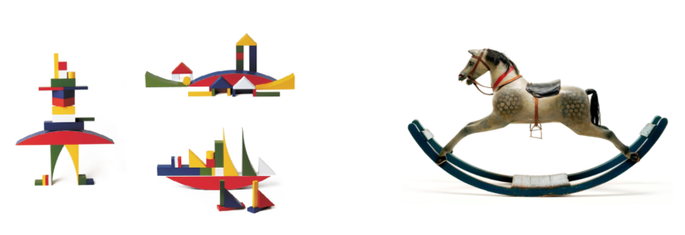
  <figcaption style="font-size: 15px;">모듈 vs 통합 시스템 ©<a href="http://craftui.com/">Alla Kholmatova</a></figcaption>
</figure>

**모듈 시스템**은 교체 및 재사용 가능한 부품으로 시스템을 구성됩니다. 빠르게 확장해야 하고 여러 사용자의 요구 사항에 적응해야 하는 프로젝트에 적합합니다. 단점은 실현하는 데 매우 많은 비용이 든다는 것입니다(부품 조립으로 잘 작동하고, 독립적으로 구성 가능한 모듈을 만드는 것이 매우 어렵기 때문). 이러한 모듈 시스템은 전자 상거래 또는 금융, 정부 웹 사이트와 같은 대규모 제품에 적합합니다. 모듈 시스템의 경우 아토믹 설계((Atomic Design)를 염두에 두고 작업하는 것이 매우 흥미로울 것입니다.

**통합 시스템**은 하나의 고유 한 컨텍스트에 중점을 둡니다. 또한 개별 부품으로 구성 되지만 이러한 부품은 조립해서 사용할 수 없습니다. 이러한 통합 시스템은 반복되는 부분이 거의 없고 자주 변경되는 아트 디렉션(포트폴리오, 쇼케이스, 마케팅 캠페인 등)이 필요한 제품에 적합합니다.

 

### 중앙 집중식(Centralized) 또는 분산형(Distributed) 방식

디자인 시스템을 구성하는 조직(organization) 방식은 시스템의 진화와 확장성에 있어 매우 중요합니다. 
[Team Models for Scaling a Design System](https://medium.com/eightshapes-llc/team-models-for-scaling-a-design-system-2cf9d03be6a0) 글에서 Nathan Curtis는 다양한 유형의 모델을 자세히 설명합니다. 아래 그림은 그 2가지 모델을 보여줍니다.

<figure style="margin: 30px auto; max-width: 550px; text-align: center;">
  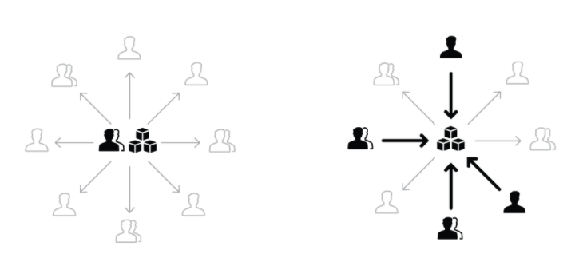
  <figcaption style="font-size: 15px;">디자인 시스템을 구성하는 모델 ♟ 중앙 집중식 vs 분산형 방식 &nbsp; ©Nathan Curtis</figcaption>
</figure>

 

**중앙 집중식 모델**은 한 팀이 시스템을 담당하고 발전 시킵니다. 이 팀은 다른 팀의 작업을 용이하게 하기 위해 시스템이 대부분의 요구 사항을 충족 할 수 있도록 다른 팀의 의견을 수용하고 반영해야 합니다. **분산형 모델**은 여러 팀의 여러 사람이 시스템을 담당 합니다. 모든 사람이 참여 하므로 시스템 채택이 보다 빠르지만 전체적인 비전을 유지할 팀의 리더도 필요합니다.

각 모델의 경우 모두 참여를 허용하고 시스템 개선을 위한 팀원의 참여 및 제안을 활발히 수용하도록 구성하는 것이 좋습니다.

 

### 디자인 시스템 유형을 결정하는 3가지 요인의 조합

따라서 제작하고자 하는 디자인 시스템 유형을 결정하기 위해 앞서 다룬 3가지 요인을 조합하여 구성해야 합니다.

<figure style="margin: 30px auto; max-width: 550px; text-align: center;">
  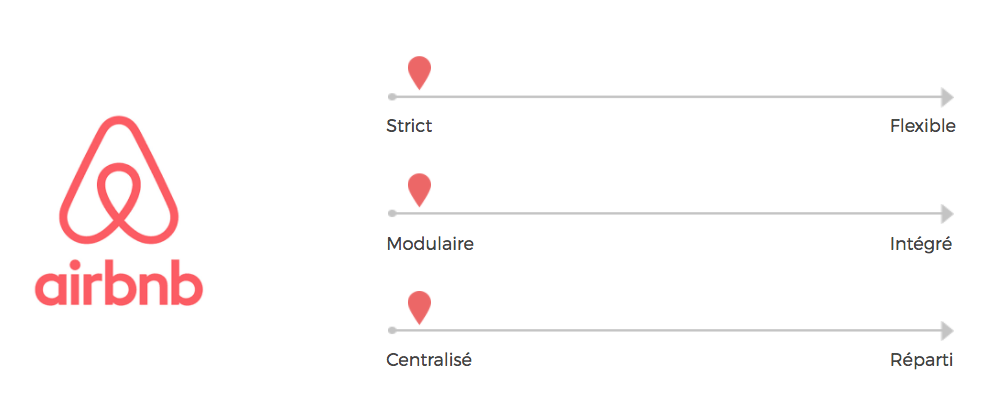
  <figcaption style="font-size: 15px;">Airbnb ⚆ 엄격한, 모듈, 중앙 집중식 시스템</figcaption>
</figure>

## 디자인 시스템 예시

본보기가 되는 좋은 디자인 시스템 예시를 살펴봅시다.

### Material 

각 요소 탐색이 쉽고 디자이너를 위한 도구를 제공하는 Material Design

<figure style="margin: 30px auto; max-width: 100%; text-align: center;">
  
  <figcaption style="font-size: 15px;"><a href="https://material.io/">Material Design System</a></figcaption>
</figure>

### IBM

디자인 언어에 대한 훌륭한 작업을 선보인 IBM

<figure style="margin: 30px auto; max-width: 100%; text-align: center;">
  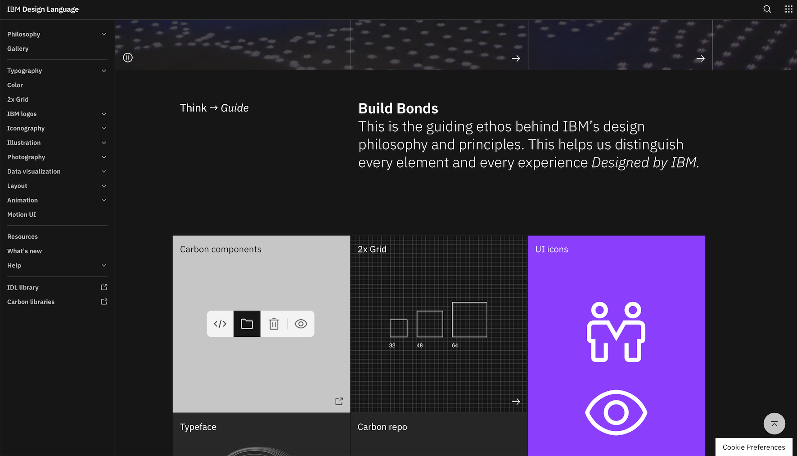
  <figcaption style="font-size: 15px;"><a href="http://ibm.com/design/language/">IBM Design Language</a></figcaption>
</figure>

### Atlassian

완전한 디자인 시스템을 구축한 Atlassian

<figure style="margin: 30px auto; max-width: 100%; text-align: center;">
  
  <figcaption style="font-size: 15px;"><a href="https://atlassian.design/">Atlassian Design System</a></figcaption>
</figure>

### Polaris

디자이너, 개발자의 워크플로우를 통합한 Shopify의 Polaris

<figure style="margin: 30px auto; max-width: 100%; text-align: center;">
  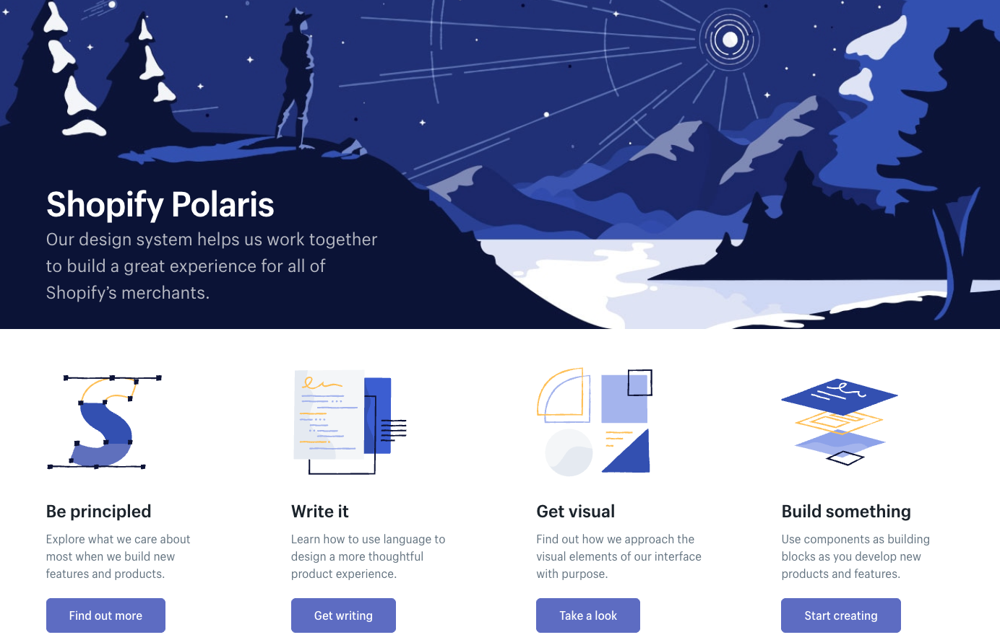
  <figcaption style="font-size: 15px;"><a href="http://polaris.shopify.com/">Polaris by Shopify</a></figcaption>
</figure>

 

## 글을 마무리 하며

디자인 시스템은 프로젝트의 주체가 다른 제품을 만드는 데 도움이 되는 완전한 제품입니다.

<figure style="margin: 30px auto; max-width: 100%; text-align: center;">
  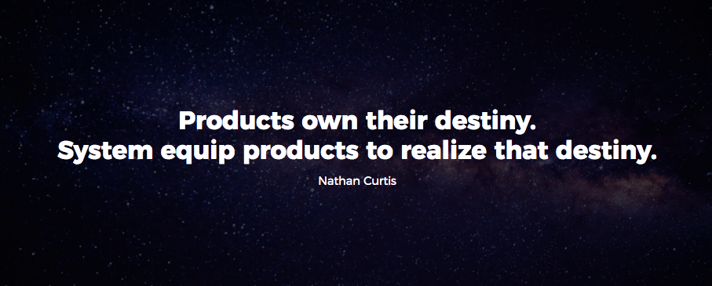
  <figcaption style="font-size: 15px;">제품은 그들의 운명을 소유하고, 시스템은 그 운명을 실현하기 위해 제품을 사용합니다. — Nathan Curtis</figcaption>
  <!-- products own their destiny. system equip products to realize that destiny.  -->
</figure>

 

모든 좋은 제품은 자체 백로그(backlog)를 갖고 있으며, 사용자(디자이너, 개발자, PO…)를 접근 방식의 중심에 유지하면서 반복적인 방식으로 자체 구축합니다.
시스템이 디자이너 또는 개발자의 워크플로우와 통합될 수록 보다 효과적일 것입니다. 이 통합의 한 가지 좋은 예는 Sketch에서 시스템의 컴포넌트와 
문서를 직접 표시하는 Polaris의 Sketch 플러그인 입니다. 따라서 디자이너는 컨셉 단계에서 필요한 모든 것을 갖추고 있습니다.

<figure style="margin: 30px auto; max-width: 550px; text-align: center;">
  
  <figcaption style="font-size: 15px;">Telescope — Polaris의 스케치 플러그인</figcaption>
</figure>

**이 모든 것은 시작에 불과합니다!**

저는 미래가 우리 삶을 용이하게 하고 우리 제품과 사용자의 경험에 집중할 수 있도록 많은 기술적인 발전이 다가올 것이라고 확신합니다.
만약 디자인 시스템에 대한 다른 글을 읽고 싶다면? 제가 작성한 "[디자인 시스템의 컴포넌트 우선 순위를 설정하는 방법](https://uxdesign.cc/workshop-how-to-prioritize-your-design-system-components-744aa99f07d7)", "[디자인 시스템의 성공을 측정하는 방법은 무엇일까요?](https://medium.com/@audreyhacq/workshop-how-to-measure-your-design-system-success-b9c3b988edc2)" 글을 참고해보세요.

 

## 참고자료

- [Alla Kholmatova](https://medium.com/@craftui)의 Design Systems 도서
- [Nathan Curtis](https://medium.com/@nathanacurtis)이 작성한 멋진 모든 글
- [Jina Anne](https://medium.com/@jina)의 컨퍼런스에서 저술한 모든 글

 

그리고 [Design System Repo](https://designsystemsrepo.com/design-systems/)에서 매우 좋은 디자인 시스템의 다른 예를 찾을 수도 있습니다.

 

읽어 주셔서 감사합니다!

---

<figure style="margin: 0">
  
  <figcaption>
    <strong style="display: block;">Audrey Hacq</strong>
    제품 디자인 책임자 @Openclassrooms & Design Systems 옹호자(advocate)
  </figcaption>
</figure>
