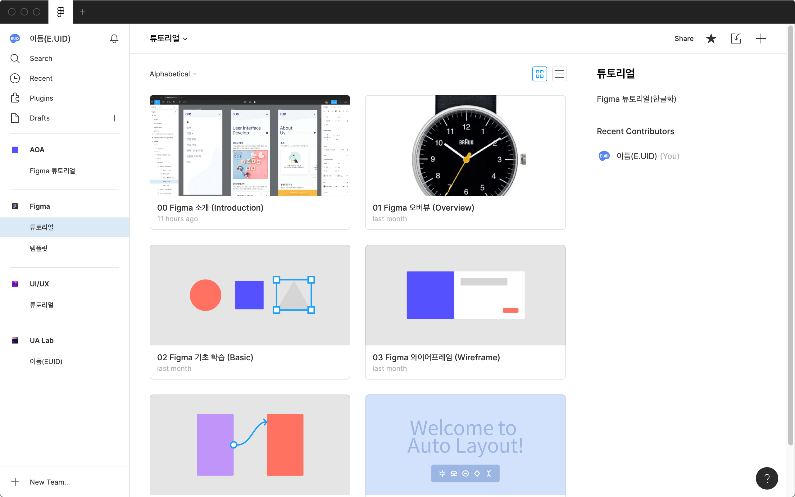
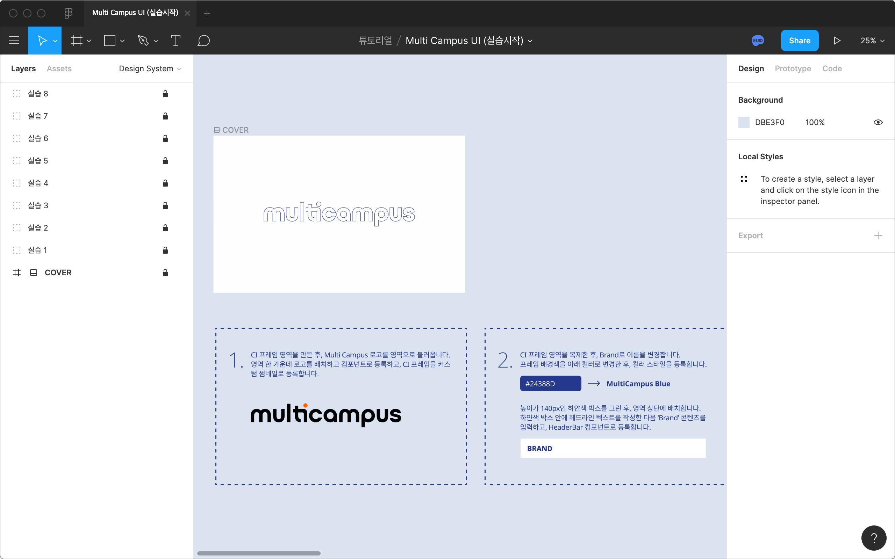
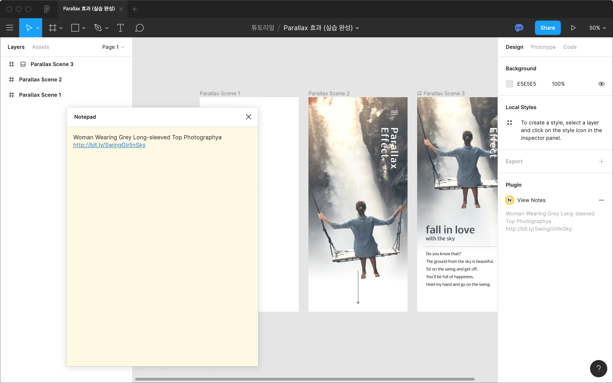

# Figma로 하는 디자인 맛보기 Class

Figma 디자인 도구를 활용하는 방법 맛보기 강의 수업 자료 저장소입니다.

## 1. Figma

Figma 디자인 도구 소개 및 기본 사용법을 학습합니다.

- Figma 도구 리뷰
- UI 디자인 도구 비교(Sketch, Adobe XD, Photoshop 등)
- Figma Config 2020(세미나 발표 해설)
- Figma 계정(Account) 생성/설정
- 파일 브라우저(File Browser)
- 외부 디자인 파일 불러오기(Sketch, Adobe XD 등)
- 도구 인터페이스(Tool Interface)
- 캔버스(Canvas)
- 프레임(Frame)
- 레이아웃 그리드(Layout Grid)
- 뷰 옵션(View Options)
- 이동 / 크기 변경(Moving & Scaling)
- 중첩(Nested) 프레임 / 슬라이싱(Slicing)
- 도형(Shapes) 그리기
- 펜(Pen), 연필(Pencil)로 그리기
- 텍스트(Text)
- 이미지(Images) 가져오기
- 이미지 마스킹(Masking)
- 레이어(Layers) 관리
- 컬러(Colors)
- 이펙트(Effects)
- 블렌딩(Blending)
- 스타일(Styles)
- 컴포넌트(Component)
- 자동 배치(Auto Layout)
- 플러그인(Plugins)

## 2. 프로토타이핑 & 핸드오프

디자인 → 프로토타이핑(코드 Zero) 제작 과정을 맛봅니다.

- 코멘트(Comments) 나누기
- 프로토타이핑(Prototyping)
- 에셋 내보내기(Exports)
- 핸드오프(Code)

## 3. 코드 맛보기

디자인 → 코드(개발) 프로세스를 맛봅니다.

- HTML, CSS 언어 소개 및 디자인
- JavaScript, DOM API 소개 및 디자인

## 튜토리얼(한글화)

Figma 팀이 제공하는 튜토리얼 문서를 한글로 번역하였습니다.

1. [Figma 오버뷰(Overview)](https://www.figma.com/file/Ed5sC3qorDVWgiCt64qZEM/01-Figma-%EC%98%A4%EB%B2%84%EB%B7%B0-Overview)
1. [Figma 기초 학습(Basic)](https://www.figma.com/file/crVSINy2eVZ4x7kvzXd6rb/02-Figma-%EA%B8%B0%EC%B4%88-%ED%95%99%EC%8A%B5-Basic)
1. [Figma 와이어프레임(Wireframe)](https://www.figma.com/file/RUrkutbkXO5zpsY0oqKYXE/03-Figma-%EC%99%80%EC%9D%B4%EC%96%B4%ED%94%84%EB%A0%88%EC%9E%84-Wireframe)
1. [Figma 프로토타입(Prototype)](https://www.figma.com/file/us6xovlKt0GLd6ZBbiuF9Y/04-Figma-%ED%94%84%EB%A1%9C%ED%86%A0%ED%83%80%EC%9E%85-Prototype)
1. [Figma 자동 배치(Auto Layout)](https://www.figma.com/file/4uQA39FDevPRDQo2cdt2cG/05-Figma-%EC%9E%90%EB%8F%99-%EB%B0%B0%EC%B9%98-Auto-Layout)

## 실습 파일

Figma 기초 툴테크닉을 학습한 후, 준비 된 실습 예제 제작를 진행해봅니다.

### 멀티 캠퍼스 UI 제작 실습

준비 된 예제 순서에 맞춰 Design Sytem → UI → Prototyping 순으로 실습을 진행합니다.

- [Multi Campus UI (실습 시작)](https://www.figma.com/file/oeC5IV5WsuUxkJ5Qh56nbd/Multi-Campus-UI-%EC%8B%A4%EC%8A%B5%EC%8B%9C%EC%9E%91)
- [Multi Campus UI (실습 완성)](https://www.figma.com/file/SGmYm8IfdRXpASo3vp4r3L/Multi-Campus-UI-%EC%8B%A4%EC%8A%B5%EC%99%84%EC%84%B1)

 

### 패럴럭스(Parallax) 프로토타이핑

준비 된 예제를 실습해 패럴럭스 프로토타입에 대해 학습합니다. (Smart Animate 활용)

- [Parallax 효과 (실습 시작)](https://www.figma.com/file/VGB3b1kWp60Y20YaLJ6IEe/Parallax-%ED%9A%A8%EA%B3%BC-%EC%8B%A4%EC%8A%B5-%EC%8B%9C%EC%9E%91)
- [Parallax 효과 (실습 완성)](https://www.figma.com/file/THBQt5XoqDFOhrQ1yYWjZA/Parallax-%ED%9A%A8%EA%B3%BC-%EC%8B%A4%EC%8A%B5-%EC%99%84%EC%84%B1)

## 디자인 시스템

- [Figma를 활용한 디자인 시스템 제작](./DesignSystem/README.md)

## 타이포그래피

- [웹 타이포그래피](./WebTypography/README.md)

## 디자인 패턴 

- [pttrns.com](https://pttrns.com)
- [ui-patterns.com](https://ui-patterns.com/patterns)
- [mobile-patterns.com](https://www.mobile-patterns.com/)

## 디자인 리소스

- [Vector 로고 - worldvectorlogo.com](https://worldvectorlogo.com)
- [Bitmap 이미지 - pexels.com](https://pexels.com)
- [Bitmap 이미지 - unsplash.com](https://unsplash.com)

## 디자인 온라인 도구

- [웹 타이포그래피 - gridlover.net](https://www.gridlover.net/try) | [8pt Grid 콘텐츠](https://gist.github.com/yamoo9/19ed3b70982d2e5be0cee0d79536d553#file-gridlover-markdown-txt)
- [웹 타이포그래피 - Basel;ne](http://b4d455.fr/basel)
- [온라인 Photo 에디터 - photopea.com](https://photopea.com)

## 디자인 레퍼런스

- [dribbble.com](https://dribbble.com)
- [behance.net](https://behance.net)

## Figma 추천 플러그인

<!-- 
  https://note.com/smikami/n/nf5114712aaa5 
  https://note.com/tribako/n/nd14d25dd5743
-->

### 더미 데이터

- [Unsplush](https://www.figma.com/c/plugin/738454987945972471/Unsplash)
- [Content Reel](https://www.figma.com/c/plugin/731627216655469013/Content-Reel)
- [Brandfetch](https://www.figma.com/c/plugin/733590967040604714/Brandfetch)

### 실제 데이터

- [Google Sheets Sync](https://www.figma.com/c/plugin/735770583268406934/Google-Sheets-Sync)

### 생산성 향상

- [Figma Walker](https://www.figma.com/c/plugin/732773762837487095/Figma-Walker)
- [Instance Finder](https://www.figma.com/c/plugin/741895659787979282/Instance-Finder)
- [Find and Replace](https://www.figma.com/c/plugin/735072959812183643/Find-and-Replace)
- [Minimap](https://www.figma.com/c/plugin/772952119002135124/Minimap)
- [Arrow Auto](https://www.figma.com/c/plugin/751007211632768205/Arrow-Auto)
- [Notepad](https://www.figma.com/c/plugin/739527655081183968/Notepad)

### 지도 

- [Map Maker](https://www.figma.com/c/plugin/731312569747199418/Map-Maker)
- [Mapsicle](https://www.figma.com/community/plugin/736458162635847353/Mapsicle)

### 프로토타입

- [SkewDat](https://www.figma.com/c/plugin/741472919529947576/SkewDat)
- [Vectary 3D](https://www.figma.com/c/plugin/769588393361258724/Vectary-3D)