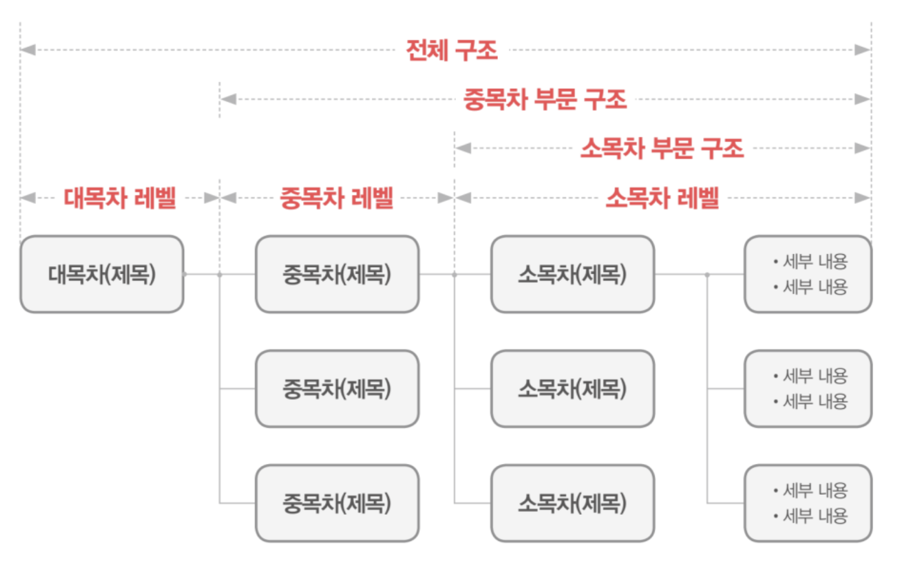
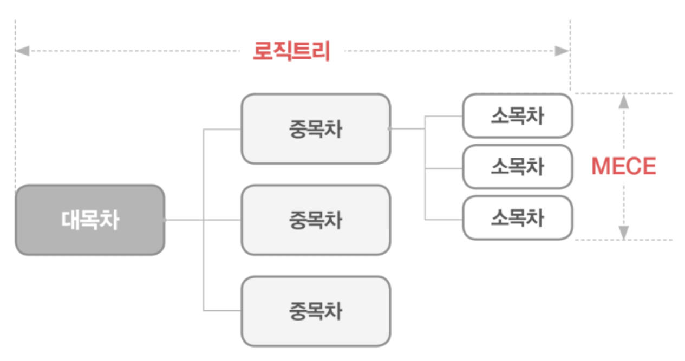
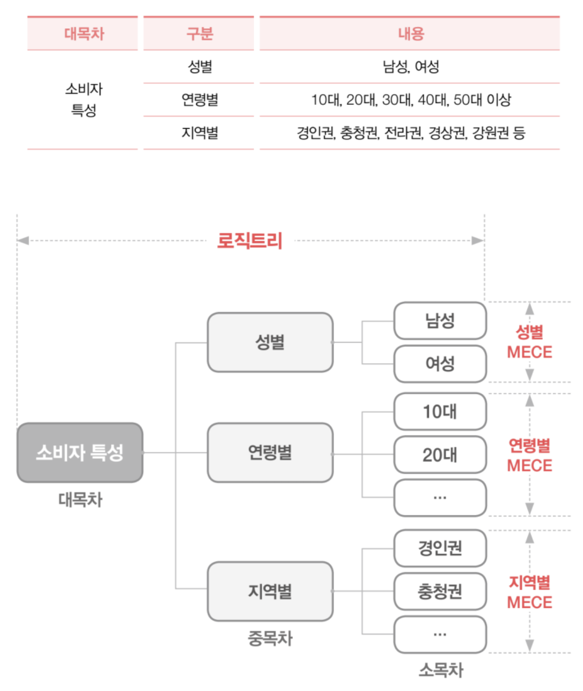

# 웹 타이포그래피


## 타이포그래피 대가들의 명언

타이포그래피에 대한 생각을 대가들의 입을 빌어 들어봅니다.

<blockquote>
  <p>규칙을 전부 마스터하면 뭐든지 할 수 있다.
  심지어 규칙을 파괴할 수도 있다.
  그런데 체계가 아예 없으면 시작조차 할 수 없다.</p>
  ― <cite>에드워드 펠라 (Edward Fella)</cite>
</blockquote>

<blockquote>
  <p>타이포그래피의 명백한 책무는 '쓰여진 정보를 정확히 전달해주는 것'이다.
이것은 어떤 논란의 여지가 있을 수 없으며 절대 무시될 수도 없다.
왜냐하면, 읽기 불편한 인쇄물은 무의미한 생산에 지나지 않기 때문이다.</p>
  ― <cite>에밀 루더(Emil Ruder)</cite>
</blockquote>

<blockquote>
  <p>타이포그래피는 보이지 않는 말을 보이게 하는 것이다.
타이포그래피는 속삭이고, 고함지르고, 노래하고, 비통해 하고, 즐거워 하고, 히히덕거리고,
그리고 중얼거릴 수 있다. 이와 같은 언어적 뉘앙스를 표현하는 여러 방법들이
바로 타이포그래피 표현의 핵심이다. 그렇기 때문에, 다양한 목소리 만큼이나
다양한 서체가 필요한 것이다.</p>
  ― <cite>에릭 스피커만(Erik Spiekermann)</cite>
</blockquote>

<blockquote>
  <p>타이포그래피는 머리로 생각한 바를 드러낸 육성이다.</p>
  ― <cite>릭 배리센티(Rick Valicenti)</cite>
</blockquote>

<blockquote>
  <p>말은 시간 속에서 진행되고, 글은 공간 속에서 진행된다.</p>
  ― <cite>칼 게르스트너(Karl Gerstner)</cite>
</blockquote>

<blockquote>
  <p>타이포그래피에 대한 나의 모든 지식은 책이나 학교에서 배우지 않았다.
오히려 나의 직관적 사고가 큰 배움을 주었다. 나는 20년대 후반부터 40년대 후반에 이르는
미국적 경향을 탐미하며, 단지 이들을 살펴보며 스스로도 의식못한 가운데 저절로 얻은 지식들을
비축했다. 이 기간 동안에서, 내가 관심 갖는 타이포그래피는 대부분 정규 교육을 받지 않았으며,
전혀 생소한 이름의 사람들이 제작한 디자인들이다. 그들은 네온 사인에서부터 성냥갑, 가스 펌프
로부터 여행용 스티커에 이르는 잡다한 것들을 디자인했다. 내 경우에 비추어 보듯, 이 디자인들은
후세를 위해 준비한 미국의 풍요한 타이포그래피 유산이다.</p>
  ― <cite>마이클 도레(Michael Doret)</cite>
</blockquote>

<blockquote>
  <p>타입은 스스로 말한다.</p>
  ― <cite>데이비드 카슨(David Carson)</cite>
</blockquote>


## 한글/영문 타이포그래피

타이포그래피는 글의 흐름(Flow)과 운율(Rhythm)을 만드는 디자인을 말합니다.


<br>
<br>

왼쪽 타이포그래피 디자인과 오른쪽 디자인의 가독성을 비교해봅니다.


<br>
<br>

강,약, 약, 중~ 약, 약♬ 리듬과 템포를 구축합니다.


한글과 영문은 근본적인 속성이 다릅니다. 그러므로 디자인 하는 방법 또한 다릅니다.


<br>
<br>


<br>
<br>


<br>
<br>
<br>
<br>

## 웹 타이포그래피 요소

### 제목 (Headings)

각 섹션(Section)은 제목이 있어야 합니다. 화면에 보이지 않더라도 말이죠.
HTML 문서의 제목은 총 6단계 레벨을 가집니다. 참고로 6단계 모두 사용해야 하는 것은 아니지만, 제목 단계는 순차적 레벨 순으로 구성되어야 합니다. (모양은 달라도 의미적 제목 수준은 6단계 안에서 구성합니다.)

1. `<h1>레벨 1</h1>`
1. `<h2>레벨 2</h2>`
1. `<h3>레벨 3</h3>`
1. `<h4>레벨 4</h4>`
1. `<h5>레벨 5</h5>`
1. `<h6>레벨 6</h6>`

#### 구조에서 제목을 도출하는 방법

문서의 전체 구조를 해석한 후, 수준에 따라 대/중/소 제목을 분류하여야 합니다.



<br>
<br>

상위 수준의 제목은 하위 수준의 제목을 포함하도록 구성해야 합니다.



<br>
<br>

예를 들어 '소비자 특성'의 상위 분류에 속하는 '성별', '연령별', '지역별' 하위 분류는 
각각의 내용을 포함하고 있을 때 데이터를 먼저 분석한 다음, 그에 따른 구조(Logic Tree)를 디자인 하여야 합니다.




### 단락 (Paragraph)

본문의 주요 구성요소로 배경과 명확히 구별되는 대비 차가 적용되어야 합니다.

```html
 <p>타이포그래피는 커뮤니케이션의 최소단위인 활자(type)로 메세지를 전하는 기술이며 그래픽디자인
 이상의 정확성과 질서를 필요로 한다. 일상생활에서 형태와 기능성을 충족시키는 역할 이외에도 한글자
 한글자에 감정과 기분, 역사와 문화를 담고있는 것이 타이포그래피의 속성이라면, 웹사이트에서 기본이
 되는 정보의 최소단위로 현재까지는 html로 보여지는 윈도우 기본서체가 웹디자인의 질적인 문제와
 가장 직결된다.</p>

 <p>편집디자인에서 가능한 본문서체의 활자선택과 세밀한 조정이 html상에서는 자유롭지 못하기 때문에
 대부분의 텍스트 정보들은 무책임하게(?) 화면에 뿌려지게 되는 경우가 많은데 사실은 본문 html
 텍스트의 정렬과 배치가 웹사이트에서 물과 공기와 같은 페이지의 환경을 만든다는 것을 염두해야
 한다.</p>

 <p>돋움체, 12px(9pt)의 활자 스펙이 정해진 상태에서 단구성, 문단의 글줄 길이, 머릿글의 형태,
 들여쓰기의 유무, 본문칼라의 선택, 중요 문구의 강조스타일 등이 디테일하게 다음어지지 않는다면
 아무리 훌륭한 컨텐츠와 네비게이션 스타일이 있다 하더라도 좋은 페이지 디자인이 되기는 힘들다.
 아무리 디자인을 공들여도 돋보이진 않지만, 못하면 낭패를 보는 것이 본문 컨텐츠의 타이포그래피
 임을 명시하자.</p>
 ```


### 하이퍼링크 (Anchor)

다른 문서와 연결(Link)하는 역할의 텍스트입니다. 링크로서 확연한 구분이 필요합니다. 

```html
<a href="http://kwangjae.com/105" target="_blank" rel="noopener noreferrer">
  웹 상에서의 한글 타이포그래피 한계를 정확히 알자.
</a>
```

뿐만 아니라, 상태(State)에 따라 디자인이 다양하게 처리되기에 각별한 신경이 필요한 요소입니다.

상태 | CSS
--- | ---
기본 | :link
방문 | :visited
마우스오버 | :hover
클릭 | :active
비활성 | .deactive

### 강조(Strong/Emphasize)

특정 글의 덩어리를 감싸 강한 소리로 뿜어내듯 디자인합니다. (예: 두껍게, 기울여서)

```html
<p>특정 <strong>글의 덩어리를 감싸 강한 소리로 뿜어내듯 디자인</strong>합니다.</p>
```

### 인용(Block Quotation)

누군가의 말이나 글을 본문에 끌어내어 쓸 때 사용합니다. (예: 따옴표, 말풍선)

```html
<blockquote>
  <p>타이포그래피의 명백한 책무는 <q>쓰여진 정보를 정확히 전달해주는 것</q>이다.
  이것은 어떤 논란의 여지가 있을 수 없으며 절대 무시될 수도 없다.
  왜냐하면, 읽기 불편한 인쇄물은 무의미한 생산에 지나지 않기 때문이다.</p>
  <cite>에밀 루더(Emil Ruder)</cite>
</blockquote>
```

### 타이포그래피 용어


용어 | CSS | 설명
--- | --- | ---
서체(타입, 글꼴, 폰트) | @font-face | **글자 모양**을 말합니다.
자족 | font-family | **글자의 가족**을 말합니다.
크기 | font-size | **글자 크기**를 말합니다.
자간 | letter-spacing | **글자 사이** 간격을 말합니다.
어간 | word-spacing | **낱말 사이** 간격을 말합니다.
행간(행 높이) | line-height | **글줄 사이** 간격을 말합니다.
행폭(행 길이) | width | **글폭** 간격을 말합니다.
정렬 | text-align | **단락 정렬**을 말합니다.
들여/내어쓰기 | text-indent | **단락 첫행 들여쓰기 유무**를 말합니다.
두껍게(폭) | font-weight | 글자를 **두껍게** 합니다. (100-900, normal, bold)
기울임(경사) | font-style | 글자를 *기울* 입니다. (normal, italic)
텍스트 꾸미기 | text-decoration | 문장에 *밑줄, 윗줄, 지움선*등을 적용합니다.
문장 줄이기 | text-overflow | 문장 길이가 길어질 경우 *자를지, 줄임 표시할지*등을 설정합니다. (clip, ellipsis)

### 영문 타이포그래피에서만 사용되는 속성

용어 | CSS | 설명
--- | --- | ---
영문 변형 | font-variant: small-caps | **영문 단어를 전체적으로 대문자로 바꾸되, 소문자는 작은 대문자로 변경** 설정합니다.
영문 변환 | text-transform | **영문장을 일괄적으로 대문자화, 소문자화, 첫글자 대문자화** 설정합니다.

### 기술 사양(Specifications)은 있으나 대부분 브라우저에서 지원되지 않는 속성

용어 | CSS | 설명
--- | --- | ---
서체 크기 조정 | font-size-adjust | **서체마다 다른 크기를 적절하게 조정하는** 설정합니다.(FF만 지원)
서체 폭 조정 | font-stretch | **글자의 폭을 넓히거나 좁히는**것을 말합니다.(지원 X)
단락 마지막 행 정렬 | text-align-last | **단락의 마지막 행 정렬 방향**을 설정합니다.(FF, IE만 지원)
양쪽 정렬, 단어 사이 간격 설정 | text-justify | **양쪽 정렬일 경우, 단어 사이 간격**을 설정합니다.(IE만 지원)
텍스트 꾸밈 색상 | text-decoration-color | **문장 꾸밈의 색상**을 설정합니다.(FF만 지원)
텍스트 꾸밈 선 형태 | text-decoration-line | **문장 꾸밈의 선 형태**를 설정합니다.(FF만 지원)
텍스트 꾸밈 선 형태 | text-decoration-line | **문장 꾸밈의 선 형태**를 설정합니다.(FF만 지원)
텍스트 꾸밈 선 스타일 유형 | text-decoration-style | **문장 꾸밈의 선 스타일 유형**을 설정합니다.(FF만 지원)

### 웹 타이포그래피 디자인 마인드

- 디자인의 시작은 타이포그래피.
- 한글과 영문 타이포그래피는 달라야 한다.
- 본문 디자인의 주 목적은 정보전달, 가독성임을 명심한다.
- 본문 단락 디자인을 기초로하여 제목, 하이퍼링크 등... 타이포그래피를 설계/완성한다.
- 웹 타이포그래피 디자인에서는 비주얼 뿐만 아니라, 퍼포먼스(성능)까지 신경써야 한다.

### 가독성이 좋은 본문 글을 디자인하는 방법

- 그래픽 소프트웨어의 타이포그래피 설정을 환경에 맞게 조정할 것!
- 웹 디자인의 특성상 본문에 사용되는 단위(unit)는 px 권장!
- 한글 본문 크기는 통상적으로 13~14px (17.3333pt~18.666667pt)
- 순수 웹 타이포그래피는 72PPI가 아닌, 96PPI에 맞게 디자인할 것!
- 자간, 어간, 행간, 행폭에 관한 통상적 설계 패턴을 따를 것!
- 웹 디자인의 특성상 포인트 텍스트 방식이 아닌, 단락 텍스트 방식을 사용할 것!


## 참고글

* [디자이너, 디자인을 말하다](http://m.blog.yes24.com/ceo71/post/7304149)
* [W3C 기술노트 | '한국어 텍스트 레이아웃 및 타이포그래피를 위한 요구사항'](http://www.w3.org/TR/klreq/korean/)
* [한글 타이포그래피. 기본에 대한 다짐에서부터.](http://kwangjae.com/105)
* [퍼블리셔, 디자인을 퍼블리싱하다](http://www.slideshare.net/yakuball/ss-42701205)
* [타이포그래피란?](http://magazine.jungle.co.kr/cat_magazine_special/detail_view.asp?master_idx=1124&pagenum=1&code=1&menu_idx=50&main_menu_idx=5&sub_menu_idx=25)
* [Typography & lettering](http://www.slideshare.net/h62160253/typography-lettering-1)
* [모바일 가독성](http://www.slideshare.net/HanaKoo1/2-13964627)
* [Typeface, Typography, Grid](http://www.slideshare.net/jihwanpark986/typeface-typography-grid?related=1)
* [basel;ne](http://b4d455.fr/basel/)
* [Golden Ratio Typography Calculator](http://www.pearsonified.com/typography/)